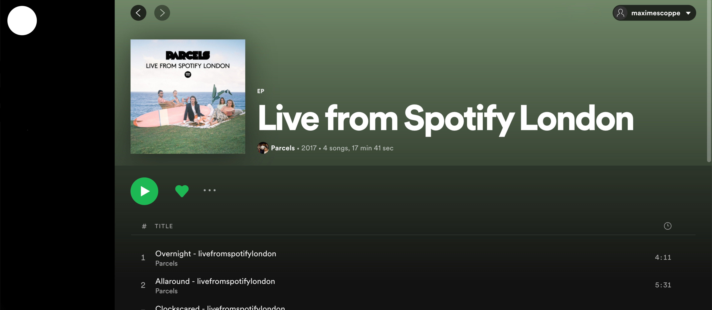

Frontend Test - Spotify
---

## Project

We'd like you to reproduce the albums grid and the album details pages from Spotify.

You may have to create a free Spotify account for your tests if you don't have one.

The first screen would be a very basic one to login on Spotify through the API. Don't spend too much time on this.

When logged in, the first page will show all the albums added on the user library - as displayed on the first screenshot.

Clicking on an album will lead to the second screen where all the album details and tracks will be shown.

No further features are asked - we don't require this app to play any song.

## Requirements

For this project, we'd like you to use:
- React
- Typescript
- GraphQL

Apart from that list, you may use any tool you consider useful.

## Data

You can get the data from this unofficial API:
https://github.com/wittydeveloper/spotify-graphql

## Sending the project

When you're done, you can push your code in a private repository on Github and invite @maximelebastard as a contributor